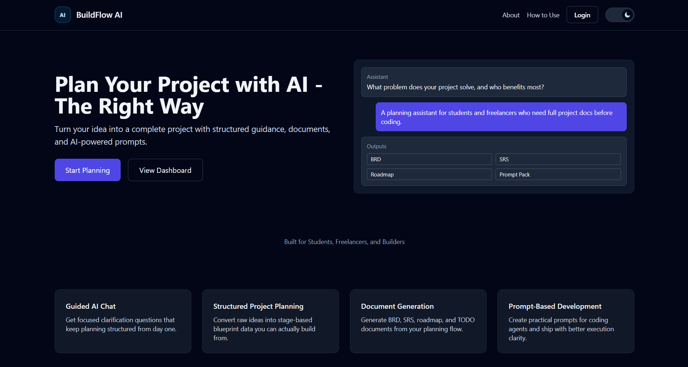
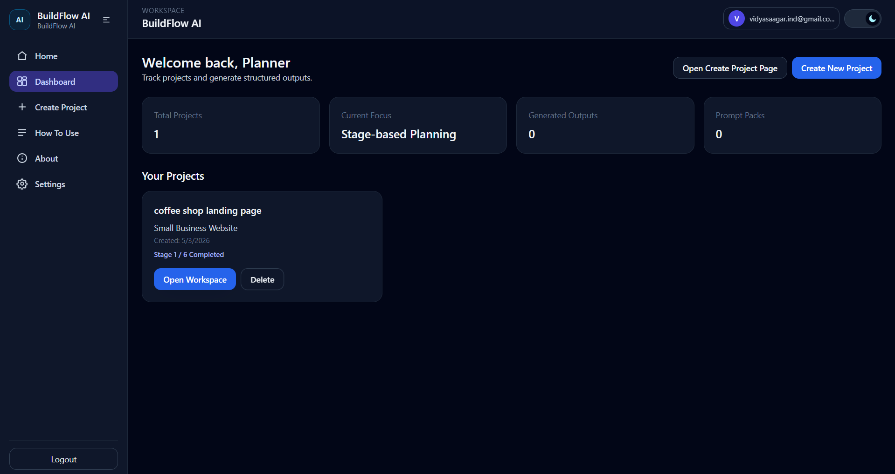
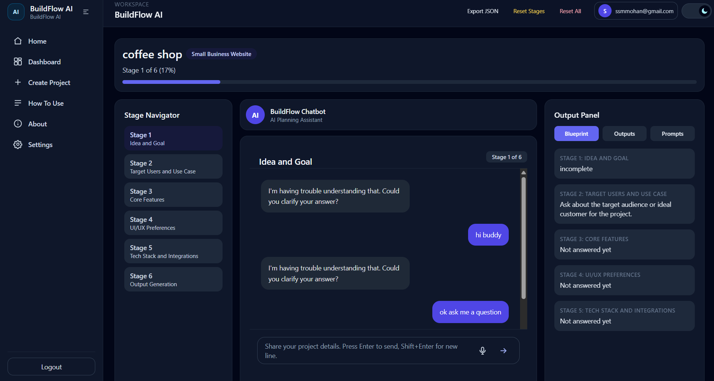
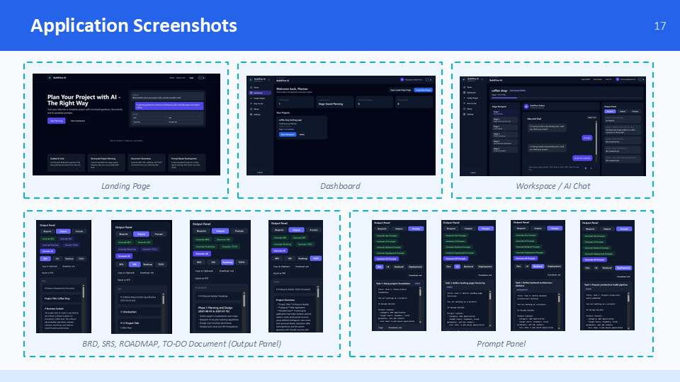

# BuildFlow AI – AI-Based Project Planning Assistant

BuildFlow AI is an AI-powered web application that helps students and developers transform a simple project idea into complete planning documents such as BRD, SRS, Roadmap, To-Do List, and implementation prompts.

---

## Live Demo

- **Frontend (Vercel):** https://buildflow-ai-frontend.vercel.app/
- **Backend API (Render):** https://buildflow-ai-backend.onrender.com/api/health

> Replace the above URLs with your actual deployed links.

---

## Project Overview

Many students and early-stage developers struggle to convert project ideas into structured technical documentation.

BuildFlow AI solves this problem by guiding users through five AI-driven planning stages and generating professional project artifacts automatically.

---

## Key Features

- Secure user authentication with Firebase
- Create and manage multiple projects
- 5-stage AI-guided project planning
- Blueprint memory for context continuity
- Generate BRD, SRS, Roadmap, and To-Do List
- Generate implementation prompts for development
- Export documents as PDF and Markdown
- Responsive UI with Light and Dark themes

---

## AI Planning Stages

1. **Project Overview** – Define title, domain, goals, and target users
2. **Requirements** – Functional and non-functional requirements
3. **Architecture** – Technology stack and system design
4. **Roadmap & Tasks** – Milestones and task breakdown
5. **Validation** – Review and generate final outputs

---

## Technology Stack

### Frontend
- React.js
- Vite
- Tailwind CSS

### Backend
- Node.js
- Express.js

### AI Engine
- OpenRouter API
- Google Gemini Model

### Database & Authentication
- Firebase Firestore
- Firebase Authentication

### Deployment
- Vercel (Frontend)
- Render (Backend)

---

## System Architecture


> Upload your architecture image to `docs/system-architecture.png` in the repository.

---

## Application Screenshots

### Landing Page


### Dashboard


### Workspace


### Generated Documents


---

## Project Structure

```text
buildflow-ai/
├── src/                  # React frontend source code
├── functions/            # Express backend API
├── public/
├── docs/
│   ├── system-architecture.png
│   └── screenshots/
├── package.json
├── vite.config.js
└── README.md
```

---

## Local Setup

### 1. Clone the Repository

```bash
git clone https://github.com/your-username/buildflow-ai.git
cd buildflow-ai
```

### 2. Install Dependencies

```bash
npm install
cd functions
npm install
```

### 3. Configure Environment Variables

#### Frontend `.env`

```env
VITE_FIREBASE_API_KEY=
VITE_FIREBASE_AUTH_DOMAIN=
VITE_FIREBASE_PROJECT_ID=
VITE_FIREBASE_STORAGE_BUCKET=
VITE_FIREBASE_MESSAGING_SENDER_ID=
VITE_FIREBASE_APP_ID=
VITE_BACKEND_URL=http://localhost:5000
```

#### Backend `.env`

```env
OPENROUTER_API_KEY=
FIREBASE_PROJECT_ID=
FIREBASE_CLIENT_EMAIL=
FIREBASE_PRIVATE_KEY=
```

### 4. Run the Project

#### Start Backend

```bash
cd functions
npm start
```

#### Start Frontend

```bash
npm run dev
```

---

## Generated Outputs

BuildFlow AI automatically generates:

- Business Requirements Document (BRD)
- Software Requirements Specification (SRS)
- Project Roadmap
- To-Do List
- Implementation Prompts

---

## Testing Summary

- Total Test Cases: 54
- Passed: 54
- Failed: 0
- Pass Rate: 100%

---

## Results and Benefits

- Saves approximately 70% of planning time
- Generates documentation 5× faster
- Maintains project context across all stages
- Produces professional, structured outputs

---

## Future Enhancements

- Team collaboration
- UML diagram generation
- DOCX and PPT export
- Voice input
- Version history
- Analytics dashboard

---

## Team Members

| Name | Register Number |
|------|------|
| AJAY M | 23TD0003 |
| SHAFI AHMED F | 23TD0076 |
| VIDYASAAGAR M | 23TD0091 |

---

## Academic Information

- **Project Type:** Mini Project
- **Department:** Computer Science and Engineering
- **College:** Rajiv Gandhi College of Engineering and Technology
- **Guide:** Dr. R. G. Suresh Kumar

---

## Repository Link

https://github.com/vidyasaagar-ind/buildflow-ai

---

## License

This project is developed for academic and educational purposes.

---

## Contact

For questions or suggestions, please open an issue in the GitHub repository.

